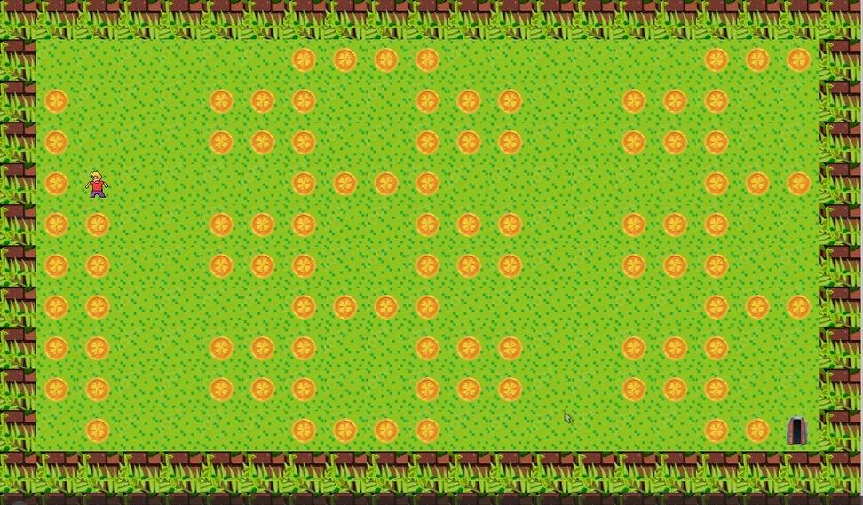

# 🧱 so_long



Um pequeno jogo 2D em **C** com **MiniLibX**, feito na **42 School**.  
O objetivo é simples: coletar todos os itens (`C`) e chegar até a saída (`E`) sem ficar preso!

---

## 🎮 Como jogar

1. **Clone o repositório:**
   ```bash
   git clone git@github.com:Bassiro-prog/so_long.git
   cd so_long


Compile:

make


Execute com um mapa:

./so_long map/mapa.ber


🗺️ Mapas de exemplo estão na pasta map/.

⌨️ Controles
Tecla	Ação
W A S D	Movimentar o personagem
ESC ou X	Sair do jogo

Gostou?
deixe uma ⭐ no repositório — isso motiva muito! 😄
